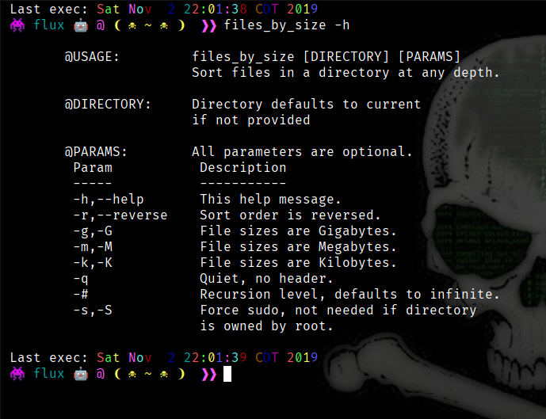

# files_by_size_bash

files_by_size is a Bash function to sort files in a directory by size with a few options.

## Usage

Output of:

```bash
files_by_size -h
```



## Dependencies

All should be available in most Linux distributions by default

- Bash
- stat
- find

## Motivation

I wanted a more effecient way of viewing large files without a GUI

## Installation

Paste this function into any script file and especially your Bash config files
E.g.: .bash_funcs or .bash_profile

## Current Releases

[[files_by_size]](files_by_size)
